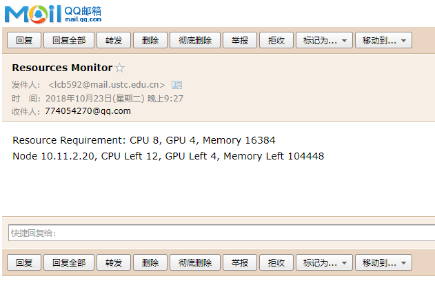

# 类脑平台资源检索邮件通知

## main.py
主程序

执行

```shell
python3 main.py --cpu8 --gpu4 --mem 16384 --sn lcb592 --pw "不告诉你" --ra 774054270@qq.com
```

当有资源满足你的需求时，你会在终端得到

```shell
Found!
```65536

同时收到邮件



## mailapp.py
邮件通知程序

```shell
from mailapp import ustcmail
ustcmail("lcb592","不告诉你密码","774054270@qq.com","正文")
```

## monitor.py
资源监视程序

```shell
from monitor import monitor1080
i, text = monitor1080(cpu需求，gpu需求，内存需求)
```
返回值 i 为是否找到的标志，text为资源信息文本。此文本即邮件通知程序的正文。


---
## 修改记录
    20181121
        根据类脑集群提供的隔离资源，在代码中添加了爬虫隔离资源并屏蔽隔离资源。
---

如有其他疑问联系本人：liuchuanbin1992@gmail.com
